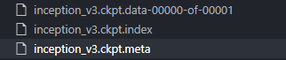
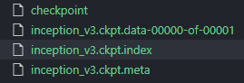
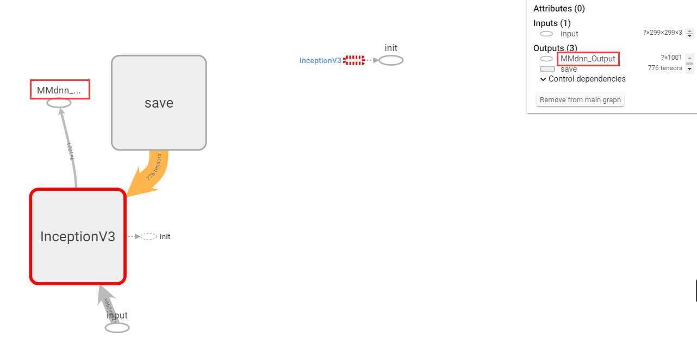

# MMDNN_simple_example

语言 : [CN](./README.md) | EN

This repo mainly introduces how to convert the pre-trained model from  Tensorflow  to  PyTorch by *<a herf='https://github.com/microsoft/MMdnn'>MMDNN</a>*

Source: TensorFlow

Destination: PyTorch

Quickly example：（You should download *inception_v3.ckpt* and pace it in models/）

You can refer to the official demo：<a herf='https://github.com/Microsoft/MMdnn/blob/master/docs/tf2pytorch.md'>https://github.com/Microsoft/MMdnn/blob/master/docs/tf2pytorch.md</a>

```sh
$python tf_save_model.py --checkpoint_path ./models/inception_v3.ckpt --output_path output_model/inception_v3.ckpt # generate .meta and .data
$cd output_model
$mmvismeta inception_v3.ckpt.meta ./logs/  # generate tesorboard file
$mmconvert -sf tensorflow -in inception_v3.ckpt.meta -iw inception_v3.ckpt --dstNode MMdnn_Output -df pytorch -om converted_pytorch.pth  # one-step converted
$cd ..
$python test.py  # test converted PyTorch model
# converted_pytorch.py and converted_pytorch.pth are the files we need 
```


1. ##  Start

   1.0 install

   ```bash
   $pip install mmdnn
   # or 
   $pip install -U git+https://github.com/Microsoft/MMdnn.git@master
   ```

   There are two ways to get the following required documents.

   --model.ckpt.meta (model network file)

   --model.ckpt.data (model weight file)

   

   

   PS: Both *inception_v3.ckpt* and *inception_v3.ckpt.data-00000-of-00001* are load by *inception_v3.ckpt*

   

   1.1 Download model by *mmdownload*

   ```bash
   $mmdownload -f tensorflow -n inception_v3
   ```
   1.2 model.py + model weight file

   ```python
   flow = tf.identity(logits_v3, name="MMdnn_Output")  
   ```

   First, you need to define the output node name(official default name: *'MMdnn_Output'*). 

   Then use ```saver.save(sess, model_path)``` to save weights

   Get the following files：

   

2. ##  conversion 

3. 2.1 One-step Commend

   ```bash
   $ mmconvert -sf tensorflow -in inception_v3.ckpt.meta -iw inception_v3.ckpt --dstNode MMdnn_Output -df pytorch -om tf_to_pytorch_inception_v3.pth
   ```

   Outputs: tf_to_pytorch_inception_v3.pth

   Arguments：

   | arguments | help message                                        |
   | --------- | --------------------------------------------------- |
   | -sf       | Source toolkit name of the model to be converted    |
   | -in       | Path to the model network file of the external tool |
   | -iw       | Path to the model weights file of the external tool |
   | --dstNode | Output node of Tensorflow                           |
   | -df       | Format of model at srcModelPath                     |
   | -om       | Path to save the destination model                  |

   

   2.2 Step-by-step Command

   * TF to IR

   ```bash
   $ mmtoir -f tensorflow -n inception_v3.ckpt.meta -w inception_v3.ckpt --dstNode outputs -o converted
   ```

   Outputs: *converted.json*，*converted.pb*，*converted.npy*
   

   * IR to PyTorch

   ```bash
   $ mmtocode -f pytorch -n converted.pb -w converted.npy -d converted_pytorch.py -dw converted_pytorch.npy
   ```

   Outputs: *converted_pytorch.py*，*converted_pytorch.npy*

   PS: You can load PyTorch with *converted_pytorch.py* and *converted_pytorch.npy*.

   * generate the final pytorch model file

   ```bash
   $ mmtomodel -f pytorch -in converted_pytorch.py -iw converted_pytorch.npy -o converted_pytorch.pth
   ```

     Outputs: *converted_pytorch.pth*

4. ## Test Model

   3.1 .pth

   You need to use ```import imp```

   ```python
   import imp
   inc_v3 = torch.load('./converted_pytorch.pth')
   inc_v3 = inc_v3.cuda().eval()
   ```

   3.2 .npy

   ```python
   inc_v3 = KitModel('./converted_pytorch.npy')
   ```

   (see detail in <a herf='./test.py'> **test.py**</a>)

## You may meet some BUG:

* **MMdnn_Output is not in graph:**

  Reason: Model don't have 'MMdnn_Output' output node.

  You can check graph use Tensorboard.  *<a herf='./models/view_graph.py'>view_graph.py</a>*

  Also using this commend to check graph：
  
  ```bash
  $ mmvismeta inception_v3.ckpt.meta ./logs/  # generate tesorboard file
  $ tensorboard --logdir=logs --port=6006 # open tensorboard
  ```




* The accuracy of Converted PyTorch model and original Tensorflow model are different.

  Reason(maybe): 
  
  1. Don't use ```model.eval()```.
  2. Data preprocessing of model is changed. Such as: Tensorflow models usually need to change image values to [-1,1], so converted model also need to do.
